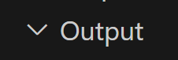

# 爬取 Yahoo 美股ETF股價資料

# 美股 ETF 股票代碼爬取 
### https://tw.tradingview.com/markets/etfs/funds-usa/

### 透過已爬取的美股 ETF 股票代碼去 Yahoo 爬取股價資料
### https://tw.stock.yahoo.com/

# 查詢方式
### 透過網站撈取 美股 ETF 代碼
### 時間 : 2015-05-01 至目前網站最新股價資訊
### 條件 : 僅抓取 2015-05-01 有股價資料
### 欄位 : 日期、開盤、收盤、最高、最低、成交量

### 安裝套件
    pip install yfinance
    pip install pandas
    pip install requests
    pip install selenium
    pip install beautifulsoup4

### 手動建立 Output 資料夾

# 環境設定

#### 安裝 pipenv

    pip install pipenv==2022.4.8

#### 安裝 repo 套件

    pipenv sync

#### 建立環境變數

    ENV=DEV python genenv.py
    ENV=DOCKER python genenv.py
    ENV=PRODUCTION python genenv.py

#### 排版

    black -l 80 crawler/

# Worker

#### 啟動預設執行 celery 的 queue 的工人

    pipenv run celery -A crawler.worker worker --loglevel=info

#### 啟動執行 twse 的 queue 的工人

    pipenv run celery -A crawler.worker worker -Q twse,tpex --loglevel=info

# Producer

#### 發送任務

    pipenv run python crawler/producer.py

#### for loop 發送多個任務

    pipenv run python crawler/producer_crawler_finmind.py

#### 發送任務到不同 queue

    pipenv run python crawler/producer_multi_queue.py

# Docker

#### build docker image

    docker build -f Dockerfile -t linsamtw/tibame_crawler:0.0.1 .
    docker build -f Dockerfile -t linsamtw/tibame_crawler:0.0.2 .
    docker build -f with.env.Dockerfile -t linsamtw/tibame_crawler:0.0.3 .
    docker build -f with.env.Dockerfile -t linsamtw/tibame_crawler:0.0.4 .

#### push docker image

    docker push linsamtw/tibame_crawler:0.0.1
    docker push linsamtw/tibame_crawler:0.0.2
    docker push linsamtw/tibame_crawler:0.0.3
    docker push linsamtw/tibame_crawler:0.0.4

#### 建立 network

    docker network create my_network

#### 啟動 rabbitmq

    docker compose -f rabbitmq-network.yml up -d

#### 關閉 rabbitmq

    docker compose -f rabbitmq-network.yml down

#### 啟動 worker

    docker compose -f docker-compose-worker-network.yml up -d
    DOCKER_IMAGE_VERSION=0.0.3 docker compose -f docker-compose-worker-network-version.yml up -d

#### 關閉 worker

    docker compose -f docker-compose-worker-network.yml down
    DOCKER_IMAGE_VERSION=0.0.3 docker compose -f docker-compose-worker-network-version.yml down

#### producer 發送任務

    docker compose -f docker-compose-producer-network.yml up -d
    DOCKER_IMAGE_VERSION=0.0.3 docker compose -f docker-compose-producer-network-version.yml up -d

#### 查看 docker container 狀況

    docker ps -a

#### 啟動 scheduler

    DOCKER_IMAGE_VERSION=0.0.4 docker compose -f docker-compose-scheduler-network-version.yml up -d

#### 關閉 scheduler

    DOCKER_IMAGE_VERSION=0.0.4 docker compose -f docker-compose-scheduler-network-version.yml down

#### 查看 log

    docker logs container_name

